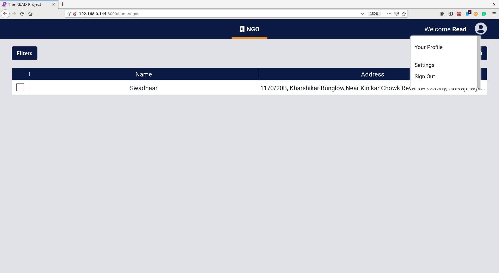
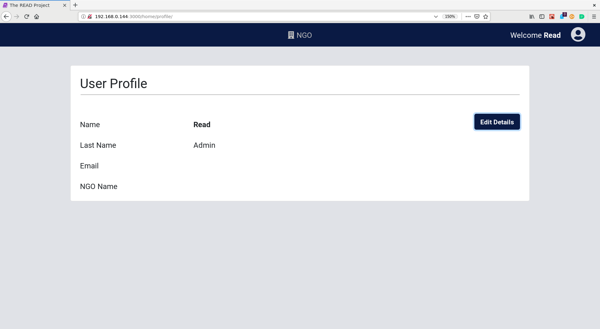
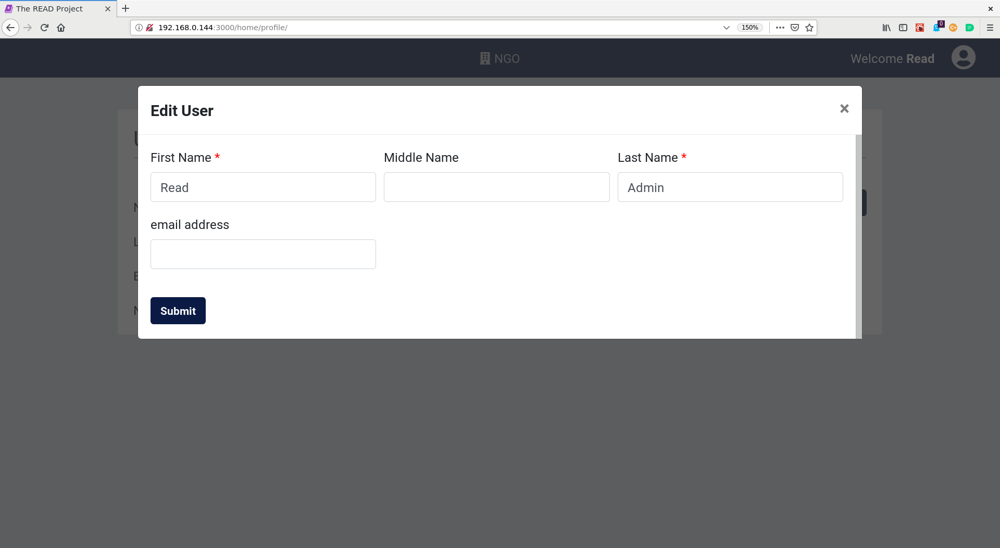
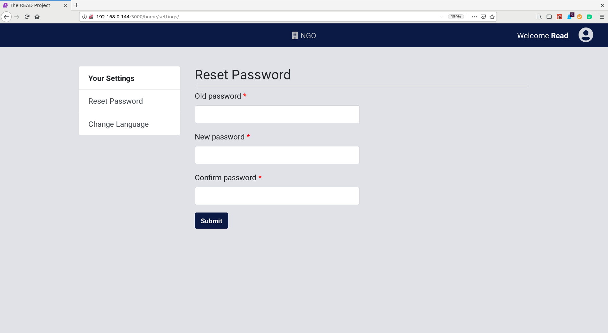
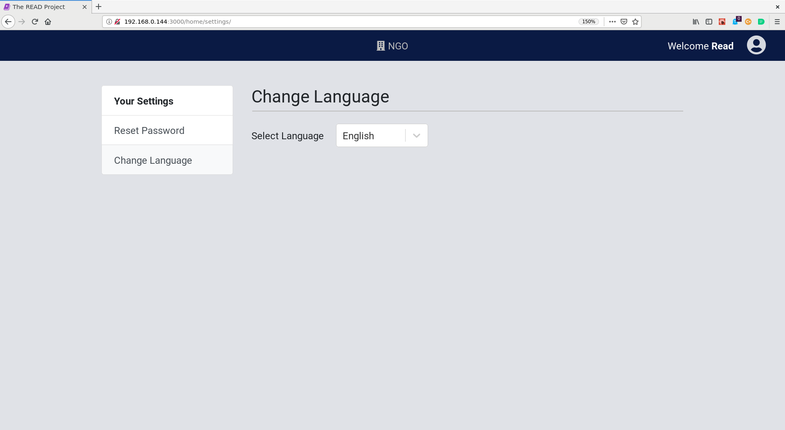

# Account settings user guide

* Access the account settings by clicking on the `top right person` icon 

## Your Profile

* Access the account settings by clicking on the `top right person` icon 
* Click on `Your Profile` Button

* Click on `Edit Details` Button
* Change the values which need to be changed

* Click on `Submit` Button

## Settings

* Access the account settings by clicking on the `top right person` icon 
* Click on `Settings` Button

### Reset password

* Access the account settings by clicking on the `top right person` icon 
* Click on `Settings` Button
* Click on `Reset password` Tab

* Enter the `old password`, `new password` and confirm the new password again in `confirm password` field
* Click on the `Submit` button

### Change language

* Access the account settings by clicking on the `top right person` icon 
* Click on `Settings` Button
* Click on `Change language` Tab

* Change the language

## Sign out

* Access the account settings by clicking on the `top right person` icon 
* Click on `Sign Out` Button.
