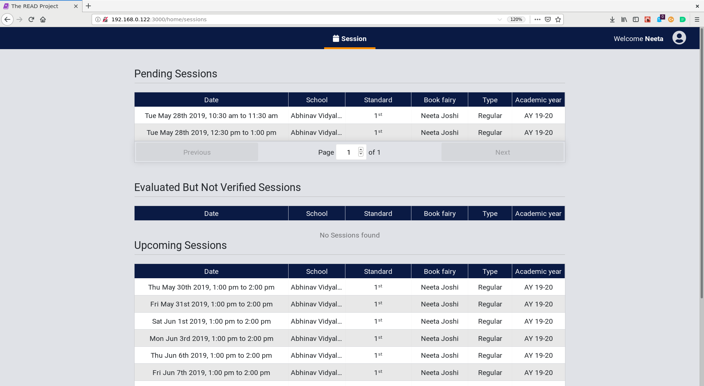

# **Book Fairy User Guide**

## **Evaluate a regular/evaluation session**

* Click on a regular/evaluation session in the `Pending Sessions` table.

* Evaluate every student in the classrooms of that session.
* Either mark a student as absent or provide the level, book and comments for that student.

* A `Save` button is provided for each classroom.
* Click on `Save` button to save the evaluations for the student of the respective classroom.
* If the save process was successful, a `tick` icon will appear on every row for which the data was successfully saved.
* After evaluating all the students, click on the `Submit` Button to send the session to the book fairy's supervisor for verification.
* The Session will now appear in the `Evaluated but not Verified Sessions` table on the Home Page

