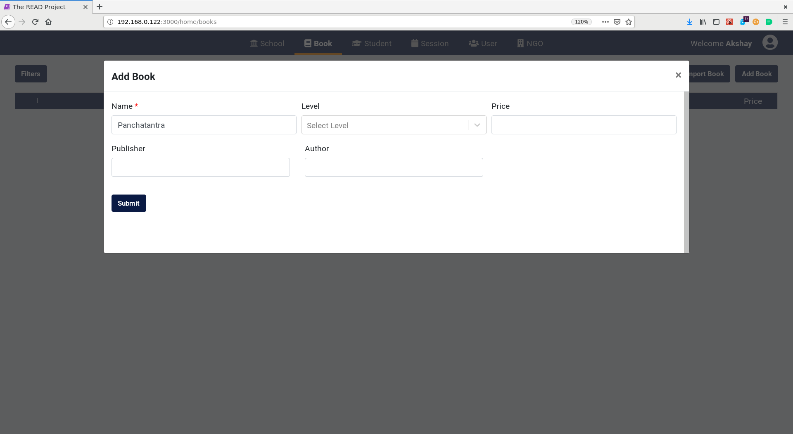
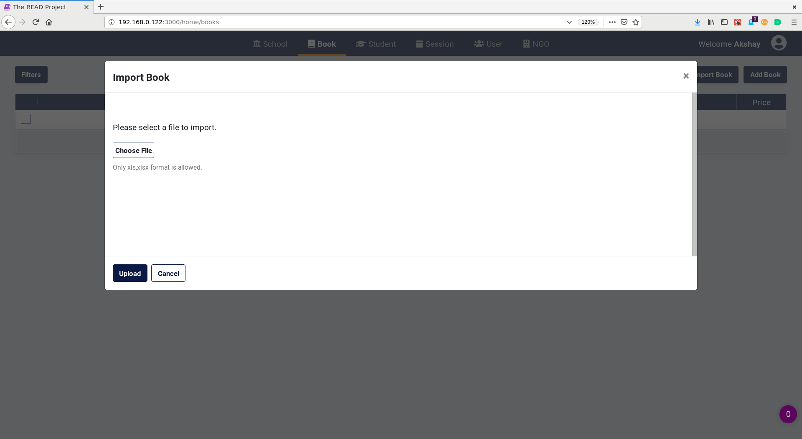
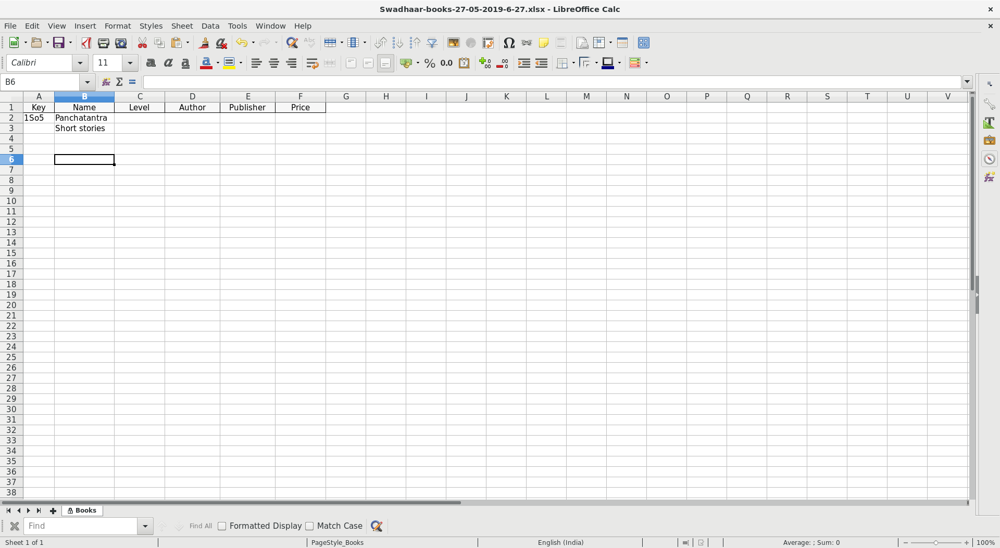
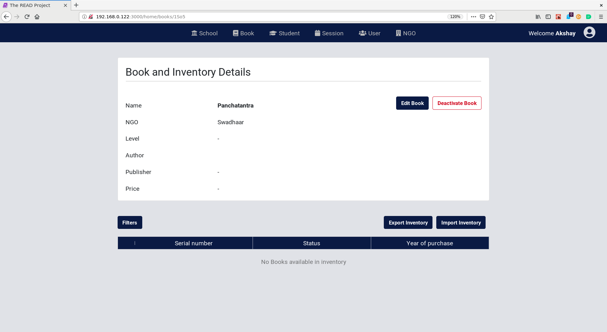
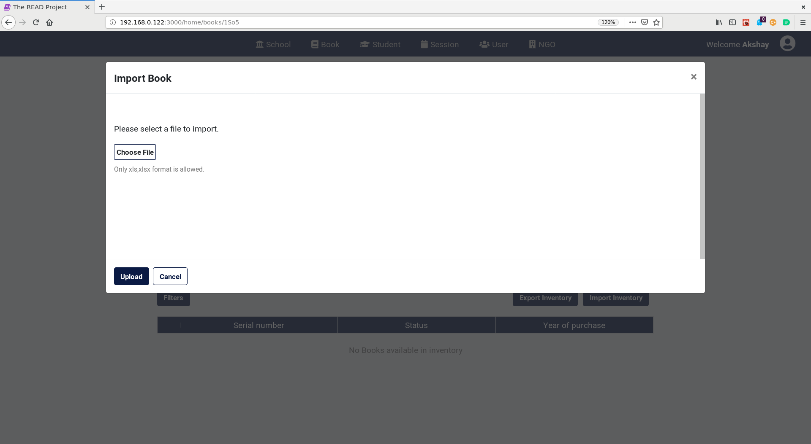
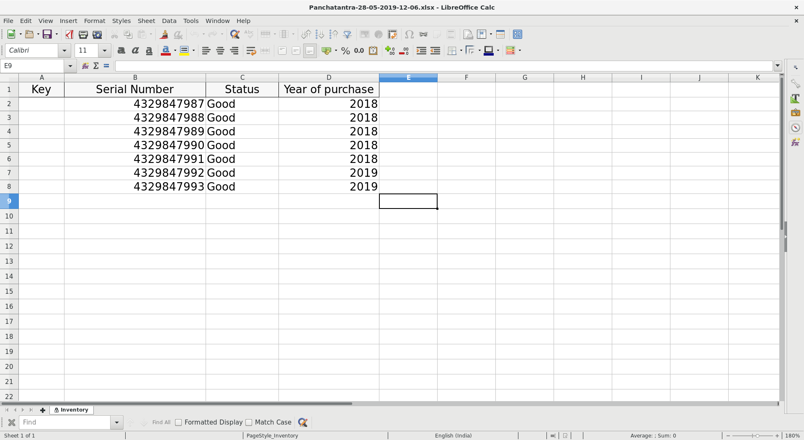

# **Book and Inventory User Guide for NGO Admin**

## **Add Book**

* Click on `Add Book` Button.

* Enter the `name`. Only this field is compulsory.
* Click on the `Submit` button.

## **Import Book**

* Click on `Import Book` Button.

* Choose an excel file with relevant book information.

* Click on the `Upload` button.
* If the file contains any errors then the errors will be shown on the screen.

## **Export Book**

* Click on `Export Book` Button.
* An excel file will be downloaded containing the information of the books under the NGO.

## **Edit Book**

* Click on a book to edit/manage the book.

* Click on `Edit Book`.
* Make the necessary changes.
* Click on `Submit` Button.

## **Deactivate Book**

* Click on the checkbox on the left for a book. Multiple selection is allowed.
* Click on `Deactivate Book`. 
* Click on the `Yes` button to confirm the delete action.

## **Manage Book Inventory**

### Import Inventory

* Click on a book in the book table to manage that book.

* Click on `Import Inventory`.

* Choose an excel file with relevant book inventory information.

* Click on the `Upload` button.
* If the file contains any errors then the errors will be shown on the screen.

### **Export Inventory**

* Click on a book in the book table to manage that book.

* Click on `Export Import` Button.
* An excel file will be downloaded containing the information of the inventory of the book.

### **Edit Inventory**

* Click on a inventory to edit/manage the inventory.
* Make the necessary changes.
* Click on `Submit` Button.

