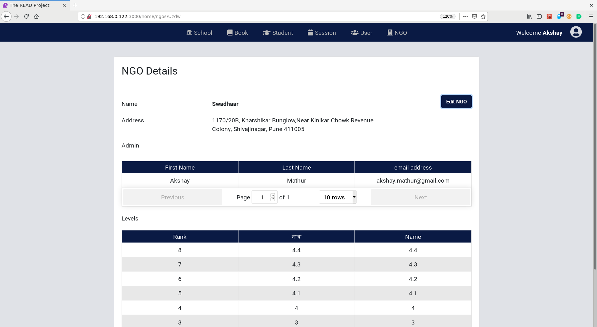
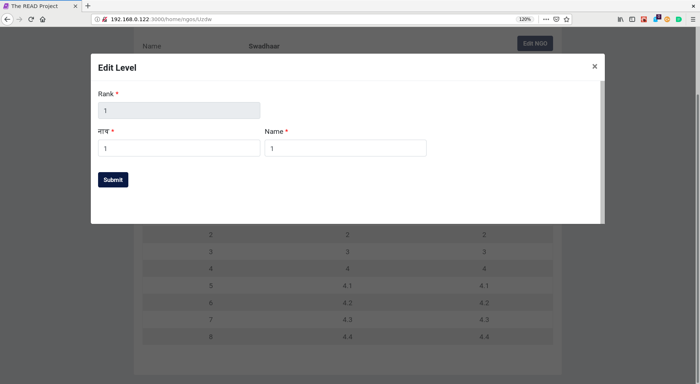
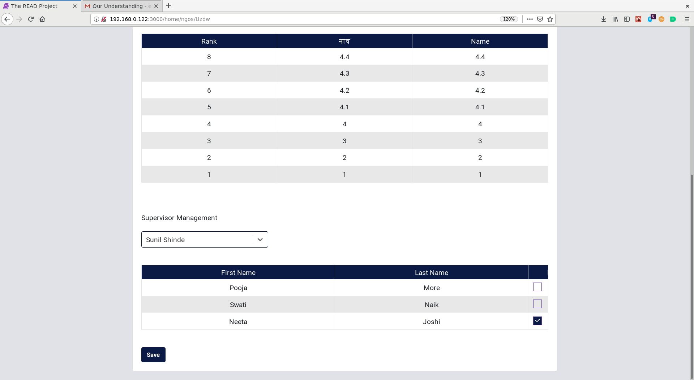

# **NGO User Guide for NGO Admin**

## **Manage NGO**

### **Edit NGO Details**

* Click on `Edit NGO` Button.

* Change the values which need to be changed.
* Click on the `Submit` button.

### **Remove NGO Admin**

* Click on an ngo which is displayed in the Table to manage a particular ngo.
* Click on `Remove` Button for a particular NGO Admin in the Admin Table.

* Click on the `Yes` button to confirm the delete action.

## **Level Management**

By default 8 levels are created for every NGO. They are ranked from 1 to 8.

For a regular session : Levels with rank `1`, `2`, `3` and `4` are shown to the book fairy while evaluating students. Change their names accordingly.

For a evaluation session : Levels with rank `1`, `2`, `3`, `5`, `6`, `7` and `8` are shown to the book fairy while evaluating students. Change their names accordingly.

* Click on a particular level to edit it
* Give the marathi and english name 

* Click on `Submit` Button.

## **Supervisor Management**

* Select a supervisor from the Dropdown menu.
* A list of all the book fairies under that supervisor will be displayed.
* Select/Unselect the book fairies as needed.

* Click on the `Save` Button

