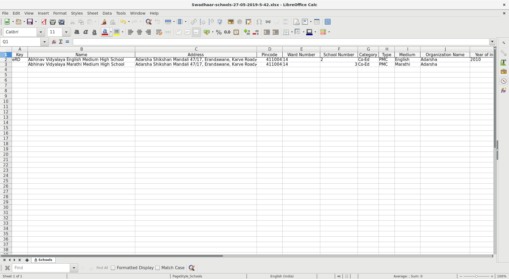

# **School User Guide for NGO Admin**

## **Add School**

* Click on `Add School` Button.

* Enter the `name`, `address`, `pincode`, `school category`, `school type` and `school medium`. These fields are compulsory.
* Click on the `Submit` button.

## **Import School**

* Click on `Import Schools` Button.

* Choose an excel file with relevant school information.

* Click on the `Upload` button.
* If the file contains any errors then the errors will be shown on the screen.

## **Export School**

* Click on `Export School` Button.
* An excel file will be downloaded containing the information of the schools under the NGO.

## **Edit/Manage School**

* Click on a school to edit/manage the school.

* Click on `Edit School`.
* Make the necessary changes.
* Click on `Submit` Button.

## **Deactivate School**

* Click on the checkbox on the left for a school. Multiple selection is allowed.
* Click on Deactivate school. 
* Click on the `Yes` button to confirm the delete action.

## Classroom management

### Add a classroom

* Click on a school in the school table to manage the school.

* Click on `Add Classroom`.

* Select the `standard` and optionally give a division name.
* Click on `Submit` Button.

### Import Students into a classroom

* Click on a school in the school table to manage the school.

* Click on `Import` button for the particular classroom in which students will be imported.

* Select an academic year. By default the current academic year is selected.
* Choose an excel file with relevant student information.

* Click on the `Upload` button.
* If the file contains any errors then the errors will be shown on the screen.

### View Students inside a classroom

* Click on a school in the school table to manage the school.

* Click on a particular classroom.

* Select an `academic year`. By default the current academic year is selected.

### Remove Student from a classroom classroom

* Click on a school in the school table to manage the school.

* Click on a particular classroom.

* Select an `academic year`. By default the current academic year is selected.
* Click on the `Deactivate` button for the particular student which you want to remove from the classroom.
* Click on the `Yes` button to confirm.
