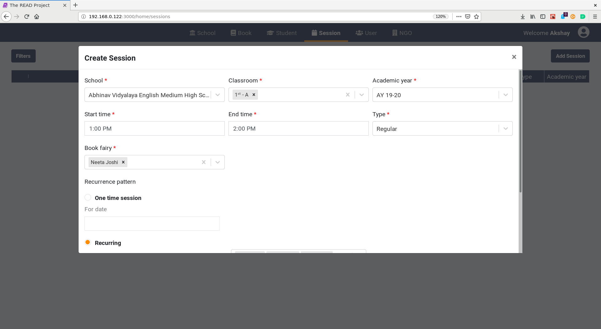
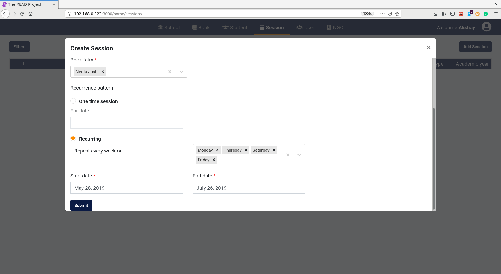
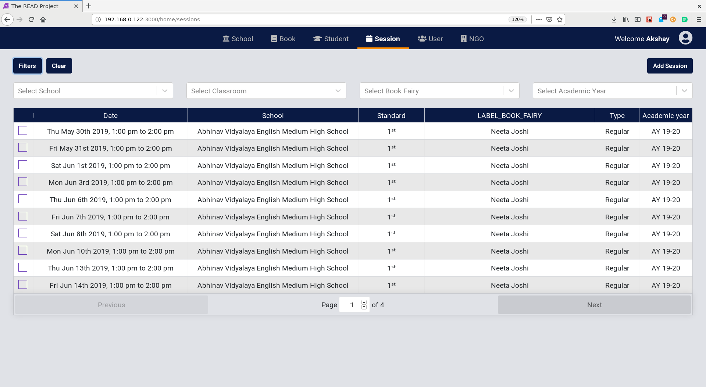

# **Session User Guide for NGO Admin**

## **Add Session**

* Click on `Add Session` Button.

* Enter the `school`, `classroom`, `academic year`, `start time`, `end time`, `session type` and`book fairy`.
* The NGO admin can create a one-off session or provide a weekly recurrence pattern for the session.

* Click on the `Submit` button.

Notes:

* There is support for multiple classrooms in a session.
* There is support for multiple book fairies in a session.
* There is support for session conflict detection for book fairies when creating a session.

## **Edit session**

* A session **cannot** be edited once the session is created.
* That session must be deleted and then created with the correct values.

## **Search for session**

* Click on `Filters` Button.
* Find the session/sessions using the filters.
* Filter by `school`, `classroom`, `book fairy` and `academic year`.

## **Cancel a session**

* Find the session using the filters.

* Click on the session.
* Click on `Cancel Session` Button
* Provide the reason for cancellation of the session.
TODO

## **Deactivate/Delete Session**

* Click on the checkbox on the left for a session. Multiple selection is allowed.
* Click on `Deactivate/Delete Session` Button. 
* Click on the `Yes` button to confirm the delete action.
