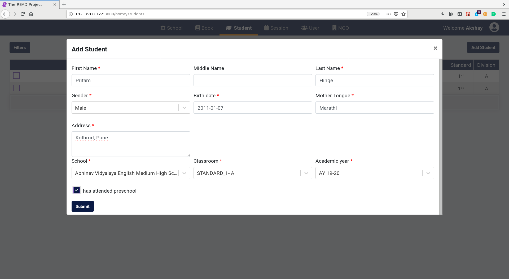
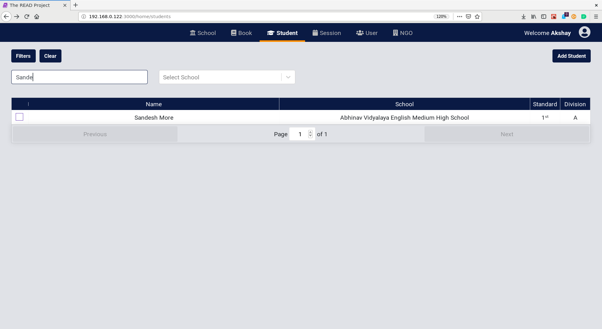
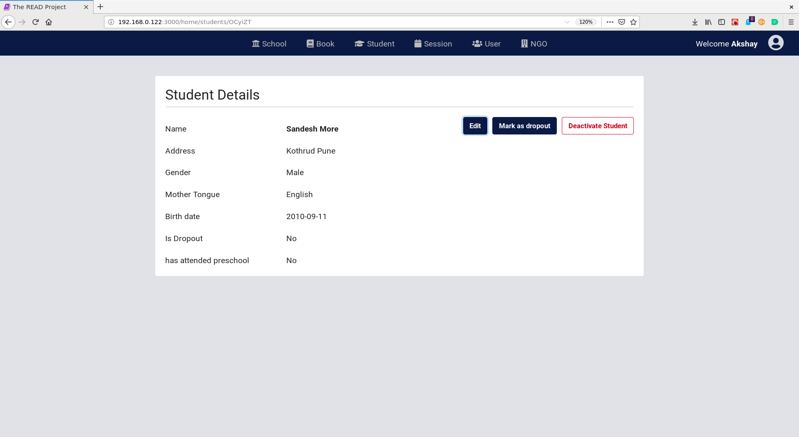

# **Student User Guide for NGO Admin**

## **Add Student**

* Click on `Add School` Button.

* Enter the `name`, `gender`, `birth date`, `mother tongue`, `address`, `school`, `classroom` and `academic year`. These fields are compulsory.
* Click on the `Submit` button.

## **Edit student details**

* Click on `Filters` Button.
* Find the student using the filters.

* Click on the student.

* Click on the `Edit` Button.
* Make the necessary changes.
* Click on `Submit` Button.

## **Mark a Student as a drop out**

* Click on `Filters` Button.
* Find the student using the filters.

* Click on the student.

* Click on the `Mark as Dropout` Button.
* Click on the `Yes` button to confirm.

## **Deactivate Student**

* Click on the checkbox on the left for a student. Multiple selection is allowed.
* Click on `Deactivate Student` Button. 
* Click on the `Yes` button to confirm the delete action.
