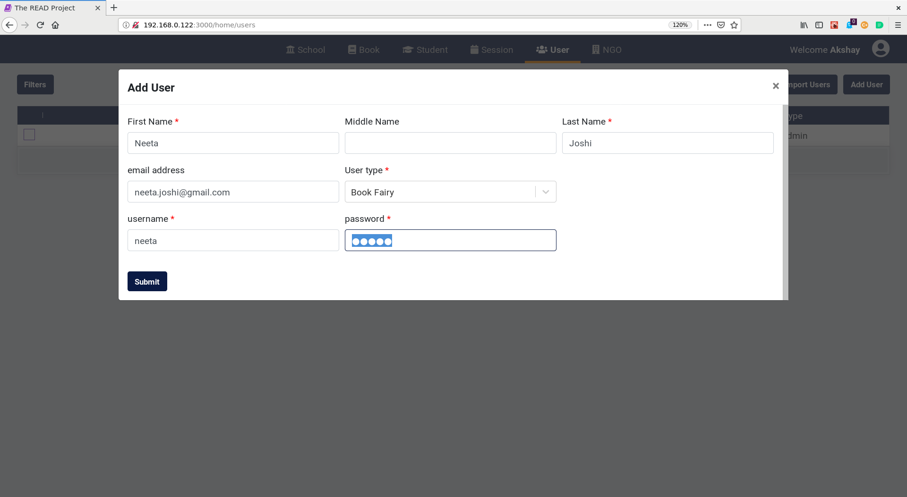
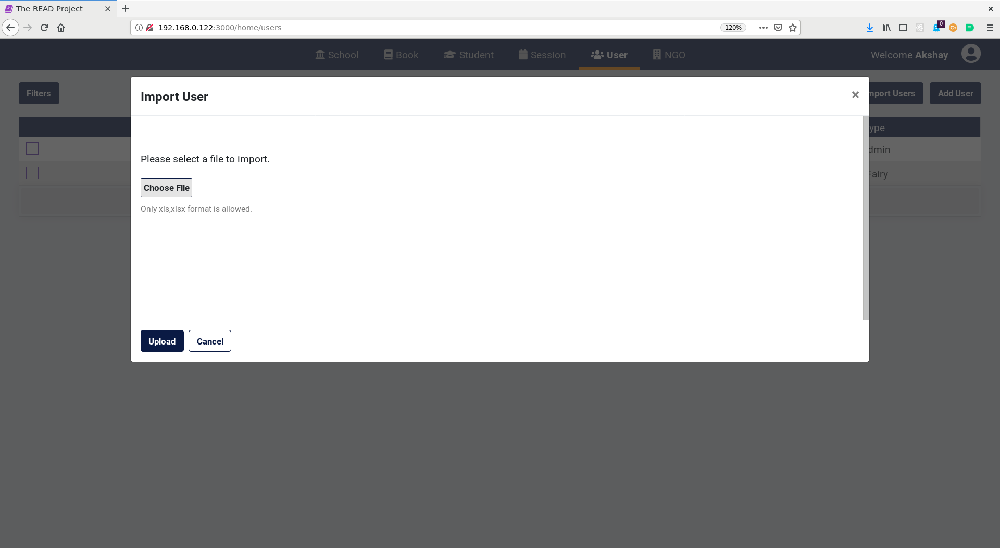
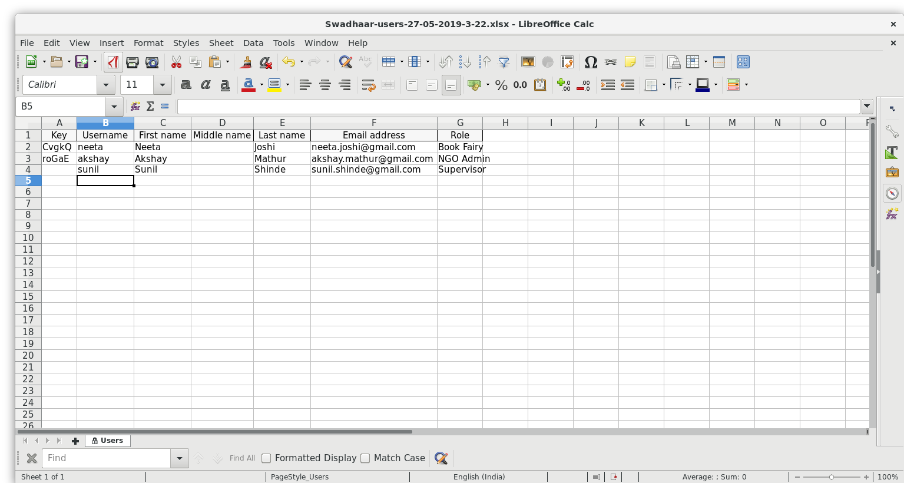

# **User management guide for NGO Admin**

## **Add User**

* Click on `Add User` Button.

* Enter the `name`, `user type`, `email address`, `username` and `password` of the new user.
* If the user type is `Book Fairy`, then `email address` field is not required.
* Click on the `Submit` button.

## **Import User**

* Click on `Import Users` Button.

* Choose an excel file with relevant user information.

* Click on the `Upload` button.
* If the file contains any errors then the errors will be shown on the screen.

## **Export User**

* Click on `Export Users` Button.
* An excel file will be downloaded containing information of the all the NGO users.

## **Edit/Manage User**

* Click on a user to edit/manage the user.
* Make the necessary changes. Change the password if needed.
* Click on `Submit` Button

## **Deactivate User**

* Click on the checkbox on the left for a user. Multiple selection is allowed.
* Click on Deactivate user. 
* Click on the `Yes` button to confirm the delete action.

