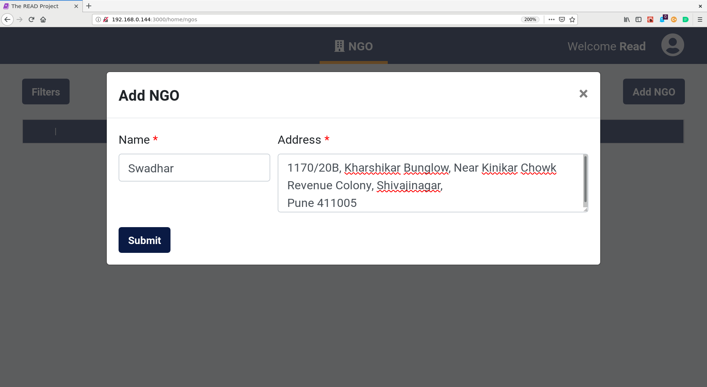

# **READ Admin User Guide**

## **Create NGO**

* Click on `Add NGO` Button
* Enter the name and address of the NGO

* Click on the `Submit` button

## **Manage NGO**
* Click on an ngo which is displayed in the Table to manage a particular ngo.

### **Edit NGO Details**

* Click on an ngo which is displayed in the Table to manage a particular ngo.
* Click on `Edit NGO` Button

* Change the values which need to be changed
* Click on the `Submit` button

### **Add NGO Admin**

* Click on an ngo which is displayed in the Table to manage a particular ngo.
* Click on `Edit NGO` Button
* Enter the `name`, `email address`, `username` and `password` for the admin
* Note the `username` and `email address` has to be **unique** for every user on the **The Read Project Platform**

* Click on the `Submit` button

### **Add remove NGO Admin**

* Click on an ngo which is displayed in the Table to manage a particular ngo.
* Click on `Remove` Button for a particular NGO Admin in the Admin Table

* Click on the `Yes` button to confirm the delete action

## **Deactivate NGO**

* Click on an ngo which is displayed in the Table which is to be deactivated.
* Click on `Deactivate NGO` Button.

* Click on the `Yes` button to confirm the delete action