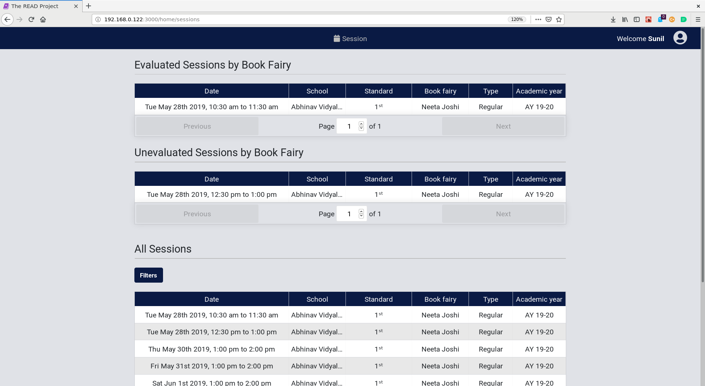
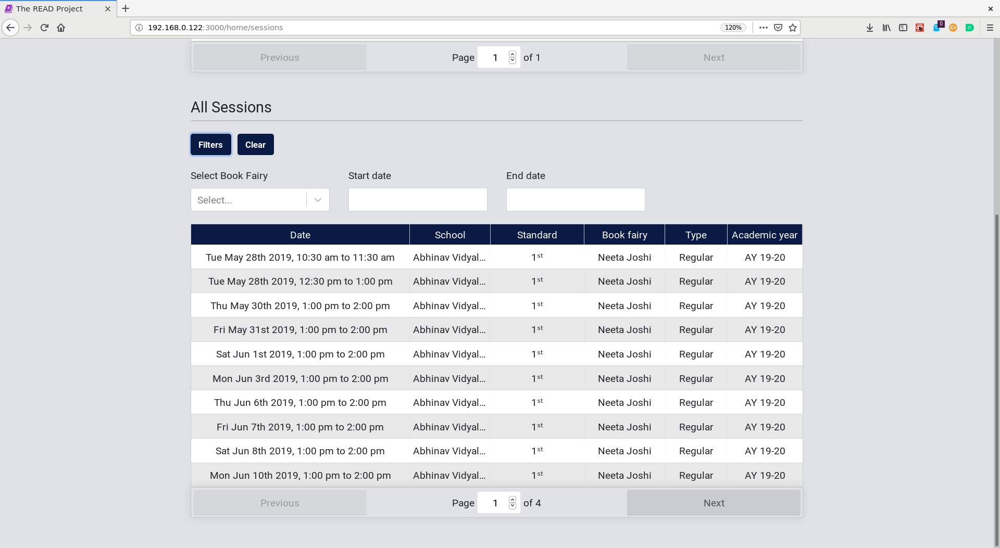
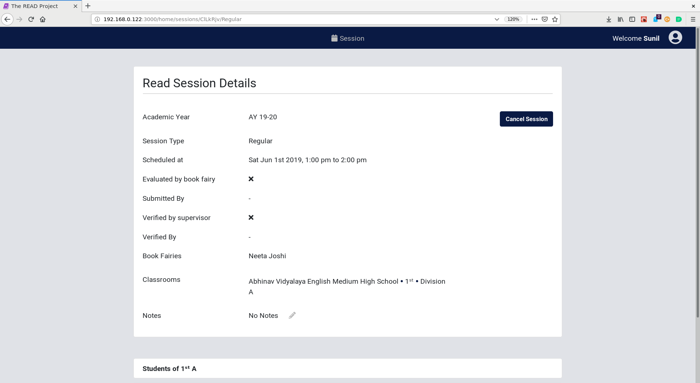
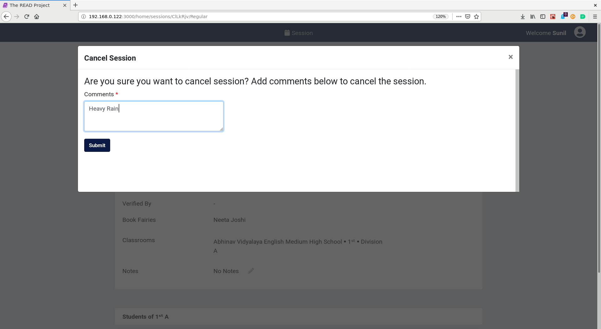

# **Supervisor User Guide**

## **Home page for Supervisor**

* `Evaluated Sessions by Book Fairy` table will show the sessions for which the book fairy has entered and submitted the data, but the supervisor is has not verified it. The Supervisor should the sessions or ask the book fairy to correct any discrepancies, if any.
* `Unevaluated Sessions by Book Fairy` table will show the sessions for which the book fairy needs to enter the evaluation data for the students in those sessions. The Supervisor must follow up with the book fairy.
* `All Sessions` table will show all the future sessions for the book fairies under the supervisor in a chronological order.

## **Search for session**

* Click on `Filters` Button.
* Find the session/sessions using the filters.
* Filter by `start date`, `end date` and `book fairy`.

## **Cancel a session**

* Find the session to be cancelled using filters.
* Click on that session.
* Click on `Cancel Session` Button.

* Provide the reason for the cancellation of the session.

* Click on `Submit` Button.
